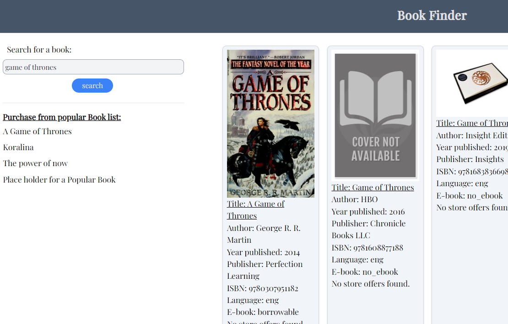
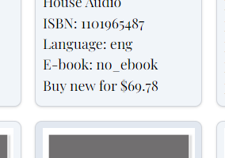

# Book Search and Buy

[Come buy a book through us!](https://hfelix3.github.io/APIProject1/)

This project implements two different API endpoints.  First we're using OPENLIBRARY.ORG to search for books.
This search is wide open, so it does title, author, subject, series, etc.  We are not forcing you to select individual search APIs

This API call to search is actually two endpoints in one.
The search call pulls up 100 items, and we used FETCH to pull this data.
The second call happens when displaying each book to pull the cover image.  Naturally if there is no image, we have a placeholder

The second API we are using is BOOKSRUN.COM.  This is only using the ISBN to pull a few bits of data.
Can we purchase this book directly and at what price.  Additionally if you can purchase it
we will include a link to purchase through an affiliate system with BOOKSRUN.COM.

This API call we opted to try AJAX instead, but abandoned it for fetch due to slow results.

Upon clicking the search button the whole list of items is redrawn.

When returning to the page, it will re-initialize your previous search automatically by storing the last search term into localstorage.

## User Story

As a Book Search and Buy user I want to be able to search books by their title, and easily purchase the book through an online retailer

## Acceptance Criteria

Given a search box
When I search for a book title I should get a list of relevant results
Then I should be able to open the listing for purchase through an online retailer if available.
